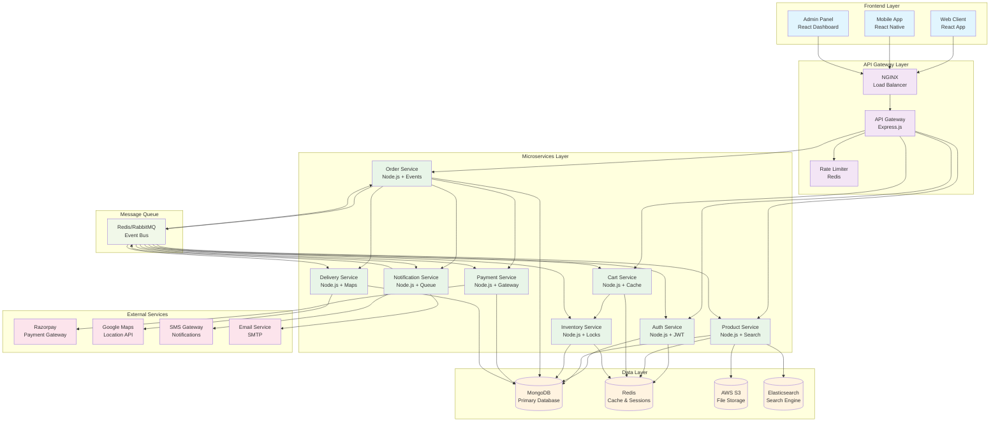
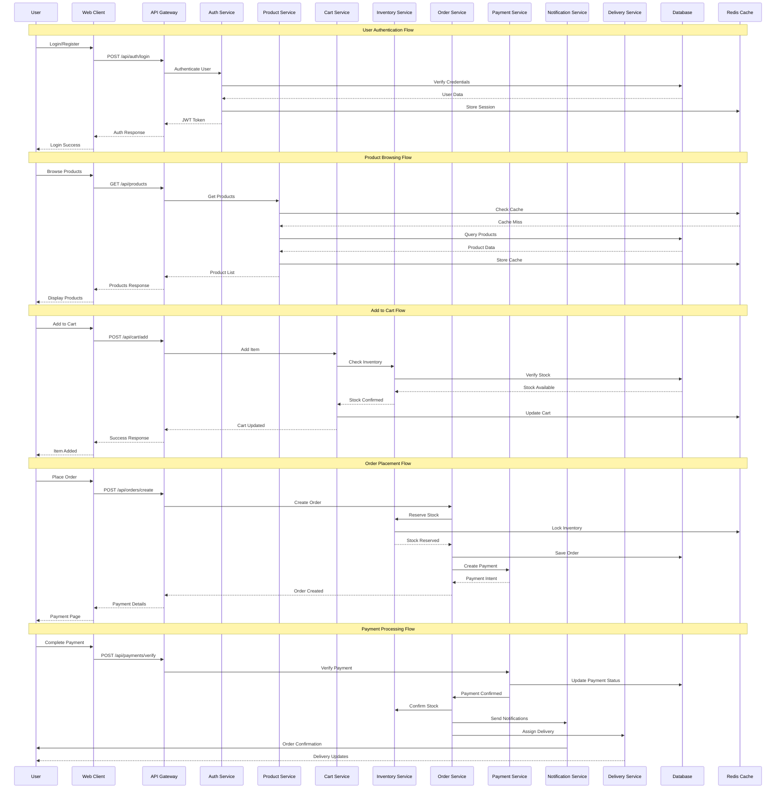
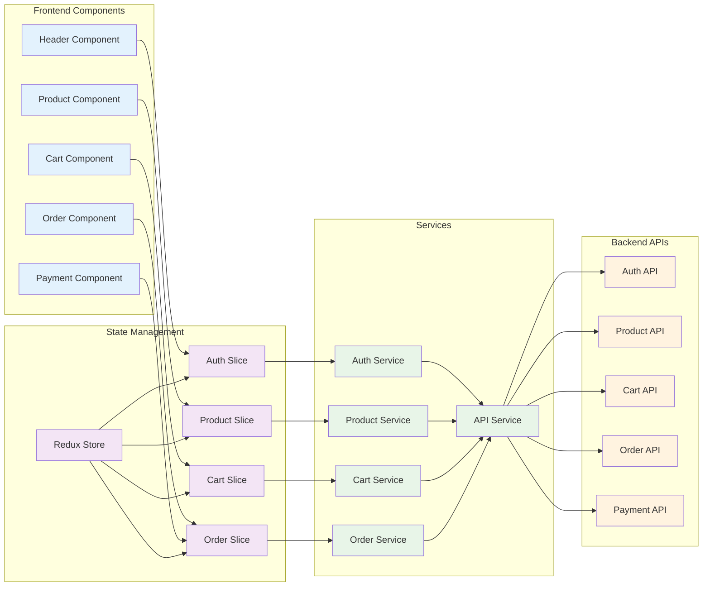

# System Architecture Flowchart - Blinkit MERN Application

## High-Level System Architecture Diagram

```mermaid
graph TB
    %% Frontend Layer
    subgraph "Frontend Layer"
        WEB[Web Client<br/>React App]
        MOBILE[Mobile App<br/>React Native]
        ADMIN[Admin Panel<br/>React Dashboard]
    end

    %% API Gateway
    subgraph "API Gateway Layer"
        NGINX[NGINX<br/>Load Balancer]
        GATEWAY[API Gateway<br/>Express.js]
        RATE[Rate Limiter<br/>Redis]
    end

    %% Microservices
    subgraph "Microservices Layer"
        AUTH[Auth Service<br/>Node.js + JWT]
        PRODUCT[Product Service<br/>Node.js + Search]
        CART[Cart Service<br/>Node.js + Cache]
        INVENTORY[Inventory Service<br/>Node.js + Locks]
        ORDER[Order Service<br/>Node.js + Events]
        PAYMENT[Payment Service<br/>Node.js + Gateway]
        NOTIFICATION[Notification Service<br/>Node.js + Queue]
        DELIVERY[Delivery Service<br/>Node.js + Maps]
    end

    %% Data Layer
    subgraph "Data Layer"
        MONGO[(MongoDB<br/>Primary Database)]
        REDIS[(Redis<br/>Cache & Sessions)]
        S3[(AWS S3<br/>File Storage)]
        ELASTIC[(Elasticsearch<br/>Search Engine)]
    end

    %% Message Queue
    subgraph "Message Queue"
        QUEUE[Redis/RabbitMQ<br/>Event Bus]
    end

    %% External Services
    subgraph "External Services"
        RAZORPAY[Razorpay<br/>Payment Gateway]
        MAPS[Google Maps<br/>Location API]
        SMS[SMS Gateway<br/>Notifications]
        EMAIL[Email Service<br/>SMTP]
    end

    %% Connections
    WEB --> NGINX
    MOBILE --> NGINX
    ADMIN --> NGINX
    
    NGINX --> GATEWAY
    GATEWAY --> RATE
    
    GATEWAY --> AUTH
    GATEWAY --> PRODUCT
    GATEWAY --> CART
    GATEWAY --> ORDER
    
    AUTH --> MONGO
    AUTH --> REDIS
    
    PRODUCT --> MONGO
    PRODUCT --> REDIS
    PRODUCT --> ELASTIC
    PRODUCT --> S3
    
    CART --> REDIS
    CART --> INVENTORY
    
    INVENTORY --> MONGO
    INVENTORY --> REDIS
    
    ORDER --> MONGO
    ORDER --> QUEUE
    ORDER --> PAYMENT
    ORDER --> NOTIFICATION
    ORDER --> DELIVERY
    
    PAYMENT --> MONGO
    PAYMENT --> RAZORPAY
    
    NOTIFICATION --> QUEUE
    NOTIFICATION --> SMS
    NOTIFICATION --> EMAIL
    
    DELIVERY --> MONGO
    DELIVERY --> MAPS
    
    %% Event flows
    QUEUE --> AUTH
    QUEUE --> PRODUCT
    QUEUE --> CART
    QUEUE --> INVENTORY
    QUEUE --> ORDER
    QUEUE --> PAYMENT
    QUEUE --> NOTIFICATION
    QUEUE --> DELIVERY

    %% Styling
    classDef frontend fill:#e1f5fe
    classDef gateway fill:#f3e5f5
    classDef microservice fill:#e8f5e8
    classDef database fill:#fff3e0
    classDef external fill:#fce4ec
    classDef queue fill:#f1f8e9

    class WEB,MOBILE,ADMIN frontend
    class NGINX,GATEWAY,RATE gateway
    class AUTH,PRODUCT,CART,INVENTORY,ORDER,PAYMENT,NOTIFICATION,DELIVERY microservice
    class MONGO,REDIS,S3,ELASTIC database
    class RAZORPAY,MAPS,SMS,EMAIL external
    class QUEUE queue
```

## Data Flow Architecture

```mermaid
sequenceDiagram
    participant U as User
    participant W as Web Client
    participant G as API Gateway
    participant A as Auth Service
    participant P as Product Service
    participant C as Cart Service
    participant I as Inventory Service
    participant O as Order Service
    participant Pay as Payment Service
    participant N as Notification Service
    participant D as Delivery Service
    participant DB as Database
    participant Cache as Redis Cache

    %% User Registration/Login
    Note over U,Cache: User Authentication Flow
    U->>W: Login/Register
    W->>G: POST /api/auth/login
    G->>A: Authenticate User
    A->>DB: Verify Credentials
    DB-->>A: User Data
    A->>Cache: Store Session
    A-->>G: JWT Token
    G-->>W: Auth Response
    W-->>U: Login Success

    %% Product Browsing
    Note over U,Cache: Product Browsing Flow
    U->>W: Browse Products
    W->>G: GET /api/products
    G->>P: Get Products
    P->>Cache: Check Cache
    Cache-->>P: Cache Miss
    P->>DB: Query Products
    DB-->>P: Product Data
    P->>Cache: Store Cache
    P-->>G: Product List
    G-->>W: Products Response
    W-->>U: Display Products

    %% Add to Cart
    Note over U,Cache: Add to Cart Flow
    U->>W: Add to Cart
    W->>G: POST /api/cart/add
    G->>C: Add Item
    C->>I: Check Inventory
    I->>DB: Verify Stock
    DB-->>I: Stock Available
    I-->>C: Stock Confirmed
    C->>Cache: Update Cart
    C-->>G: Cart Updated
    G-->>W: Success Response
    W-->>U: Item Added

    %% Order Placement
    Note over U,Cache: Order Placement Flow
    U->>W: Place Order
    W->>G: POST /api/orders/create
    G->>O: Create Order
    O->>I: Reserve Stock
    I->>Cache: Lock Inventory
    I-->>O: Stock Reserved
    O->>DB: Save Order
    O->>Pay: Create Payment
    Pay-->>O: Payment Intent
    O-->>G: Order Created
    G-->>W: Payment Details
    W-->>U: Payment Page

    %% Payment Processing
    Note over U,Cache: Payment Processing Flow
    U->>W: Complete Payment
    W->>G: POST /api/payments/verify
    G->>Pay: Verify Payment
    Pay->>DB: Update Payment Status
    Pay->>O: Payment Confirmed
    O->>I: Confirm Stock
    O->>N: Send Notifications
    O->>D: Assign Delivery
    N->>U: Order Confirmation
    D-->>U: Delivery Updates
```

## Component Interaction Diagram

```mermaid
graph LR
    subgraph "Frontend Components"
        HC[Header Component]
        PC[Product Component]
        CC[Cart Component]
        OC[Order Component]
        PayC[Payment Component]
    end

    subgraph "State Management"
        RS[Redux Store]
        AS[Auth Slice]
        PS[Product Slice]
        CS[Cart Slice]
        OS[Order Slice]
    end

    subgraph "Services"
        API[API Service]
        AuthS[Auth Service]
        ProductS[Product Service]
        CartS[Cart Service]
        OrderS[Order Service]
    end

    subgraph "Backend APIs"
        AuthAPI[Auth API]
        ProductAPI[Product API]
        CartAPI[Cart API]
        OrderAPI[Order API]
        PaymentAPI[Payment API]
    end

    %% Component to State connections
    HC --> AS
    PC --> PS
    CC --> CS
    OC --> OS
    PayC --> OS

    %% State to Service connections
    AS --> AuthS
    PS --> ProductS
    CS --> CartS
    OS --> OrderS

    %% Service to API connections
    AuthS --> API
    ProductS --> API
    CartS --> API
    OrderS --> API

    %% API to Backend connections
    API --> AuthAPI
    API --> ProductAPI
    API --> CartAPI
    API --> OrderAPI
    API --> PaymentAPI

    %% Redux Store connections
    RS --> AS
    RS --> PS
    RS --> CS
    RS --> OS

    %% Styling
    classDef component fill:#e3f2fd
    classDef state fill:#f3e5f5
    classDef service fill:#e8f5e8
    classDef api fill:#fff3e0

    class HC,PC,CC,OC,PayC component
    class RS,AS,PS,CS,OS state
    class API,AuthS,ProductS,CartS,OrderS service
    class AuthAPI,ProductAPI,CartAPI,OrderAPI,PaymentAPI api
```
