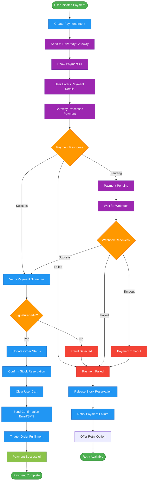
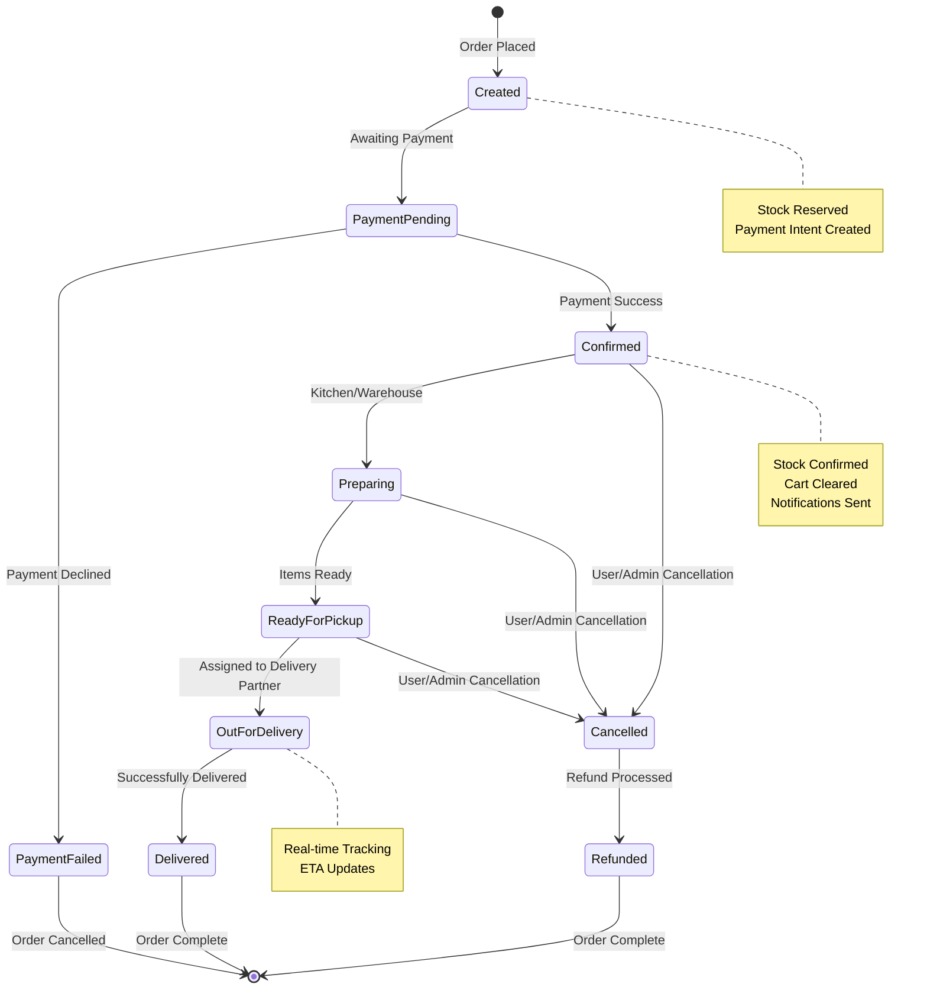

# Process Flow Flowchart - Blinkit MERN Application

## Complete User Journey: Cart to Payment

```mermaid
flowchart TD
    START([User Starts Shopping]) --> BROWSE[Browse Products]
    BROWSE --> SELECT[Select Product]
    SELECT --> ADD_CART{Add to Cart?}
    
    ADD_CART -->|Yes| VALIDATE_PRODUCT[Validate Product]
    ADD_CART -->|No| BROWSE
    
    VALIDATE_PRODUCT --> CHECK_INVENTORY[Check Inventory]
    CHECK_INVENTORY --> INVENTORY_OK{Stock Available?}
    
    INVENTORY_OK -->|No| OUT_OF_STOCK[Show Out of Stock]
    OUT_OF_STOCK --> BROWSE
    
    INVENTORY_OK -->|Yes| UPDATE_CART[Update Cart in Redis]
    UPDATE_CART --> CART_SUCCESS[Cart Updated Successfully]
    CART_SUCCESS --> CONTINUE{Continue Shopping?}
    
    CONTINUE -->|Yes| BROWSE
    CONTINUE -->|No| VIEW_CART[View Cart]
    
    VIEW_CART --> VALIDATE_CART[Validate Cart Items]
    VALIDATE_CART --> CART_VALID{Cart Valid?}
    
    CART_VALID -->|No| SHOW_ERRORS[Show Validation Errors]
    SHOW_ERRORS --> FIX_CART[Fix Cart Issues]
    FIX_CART --> VIEW_CART
    
    CART_VALID -->|Yes| CHECKOUT[Proceed to Checkout]
    CHECKOUT --> SELECT_ADDRESS[Select Delivery Address]
    SELECT_ADDRESS --> SELECT_PAYMENT[Select Payment Method]
    SELECT_PAYMENT --> CREATE_ORDER[Create Order]
    
    CREATE_ORDER --> RESERVE_STOCK[Reserve Stock]
    RESERVE_STOCK --> STOCK_RESERVED{Stock Reserved?}
    
    STOCK_RESERVED -->|No| STOCK_FAILED[Stock Reservation Failed]
    STOCK_FAILED --> VIEW_CART
    
    STOCK_RESERVED -->|Yes| GENERATE_PAYMENT[Generate Payment Intent]
    GENERATE_PAYMENT --> PAYMENT_PAGE[Show Payment Page]
    PAYMENT_PAGE --> PROCESS_PAYMENT[Process Payment]
    
    PROCESS_PAYMENT --> PAYMENT_SUCCESS{Payment Success?}
    
    PAYMENT_SUCCESS -->|No| PAYMENT_FAILED[Payment Failed]
    PAYMENT_FAILED --> RELEASE_STOCK[Release Reserved Stock]
    RELEASE_STOCK --> PAYMENT_PAGE
    
    PAYMENT_SUCCESS -->|Yes| CONFIRM_ORDER[Confirm Order]
    CONFIRM_ORDER --> UPDATE_INVENTORY[Update Inventory]
    UPDATE_INVENTORY --> CLEAR_CART[Clear User Cart]
    CLEAR_CART --> SEND_NOTIFICATIONS[Send Notifications]
    SEND_NOTIFICATIONS --> ASSIGN_DELIVERY[Assign Delivery Partner]
    ASSIGN_DELIVERY --> ORDER_CONFIRMED[Order Confirmed]
    ORDER_CONFIRMED --> TRACK_ORDER[Track Order]
    TRACK_ORDER --> END([Order Complete])

    %% Styling
    classDef startEnd fill:#4caf50,stroke:#2e7d32,color:#fff
    classDef process fill:#2196f3,stroke:#1565c0,color:#fff
    classDef decision fill:#ff9800,stroke:#ef6c00,color:#fff
    classDef error fill:#f44336,stroke:#c62828,color:#fff
    classDef success fill:#8bc34a,stroke:#558b2f,color:#fff

    class START,END startEnd
    class BROWSE,SELECT,VALIDATE_PRODUCT,CHECK_INVENTORY,UPDATE_CART,VIEW_CART,VALIDATE_CART,CHECKOUT,SELECT_ADDRESS,SELECT_PAYMENT,CREATE_ORDER,RESERVE_STOCK,GENERATE_PAYMENT,PAYMENT_PAGE,PROCESS_PAYMENT,CONFIRM_ORDER,UPDATE_INVENTORY,CLEAR_CART,SEND_NOTIFICATIONS,ASSIGN_DELIVERY,TRACK_ORDER process
    class ADD_CART,INVENTORY_OK,CONTINUE,CART_VALID,STOCK_RESERVED,PAYMENT_SUCCESS decision
    class OUT_OF_STOCK,SHOW_ERRORS,STOCK_FAILED,PAYMENT_FAILED,RELEASE_STOCK error
    class CART_SUCCESS,ORDER_CONFIRMED success
```



## Stock Reservation Process

```mermaid
flowchart TD
    START_RESERVE([Start Stock Reservation]) --> GET_LOCK[Acquire Distributed Lock]
    GET_LOCK --> LOCK_SUCCESS{Lock Acquired?}
    
    LOCK_SUCCESS -->|No| LOCK_FAILED[Lock Failed - Retry]
    LOCK_FAILED --> WAIT[Wait 100ms]
    WAIT --> GET_LOCK
    
    LOCK_SUCCESS -->|Yes| CHECK_CURRENT[Check Current Inventory]
    CHECK_CURRENT --> CALCULATE[Calculate Available Stock]
    CALCULATE --> SUFFICIENT{Sufficient Stock?}
    
    SUFFICIENT -->|No| RELEASE_LOCK[Release Lock]
    RELEASE_LOCK --> INSUFFICIENT[Return Insufficient Stock]
    INSUFFICIENT --> END_FAIL([Reservation Failed])
    
    SUFFICIENT -->|Yes| UPDATE_RESERVED[Update Reserved Quantity]
    UPDATE_RESERVED --> SET_EXPIRY[Set Reservation Expiry (10min)]
    SET_EXPIRY --> LOG_MOVEMENT[Log Inventory Movement]
    LOG_MOVEMENT --> RELEASE_LOCK2[Release Lock]
    RELEASE_LOCK2 --> SUCCESS[Return Success]
    SUCCESS --> END_SUCCESS([Reservation Successful])

    %% Auto-expiry process
    SET_EXPIRY -.-> TIMER[Timer: 10 minutes]
    TIMER -.-> AUTO_RELEASE[Auto-release if not confirmed]
    AUTO_RELEASE -.-> RESTORE_STOCK[Restore Reserved Stock]

    %% Styling
    classDef startEnd fill:#4caf50,stroke:#2e7d32,color:#fff
    classDef process fill:#2196f3,stroke:#1565c0,color:#fff
    classDef decision fill:#ff9800,stroke:#ef6c00,color:#fff
    classDef error fill:#f44336,stroke:#c62828,color:#fff
    classDef timer fill:#9c27b0,stroke:#6a1b9a,color:#fff

    class START_RESERVE,END_FAIL,END_SUCCESS startEnd
    class GET_LOCK,CHECK_CURRENT,CALCULATE,UPDATE_RESERVED,SET_EXPIRY,LOG_MOVEMENT,RELEASE_LOCK,RELEASE_LOCK2,WAIT process
    class LOCK_SUCCESS,SUFFICIENT decision
    class LOCK_FAILED,INSUFFICIENT error
    class TIMER,AUTO_RELEASE,RESTORE_STOCK timer
```

## Payment Processing Flow



## Order Status Lifecycle


